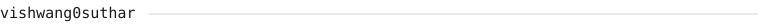
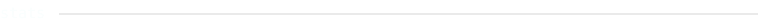
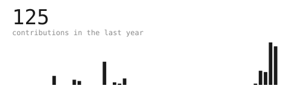
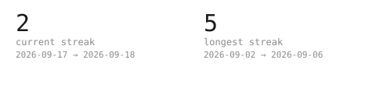
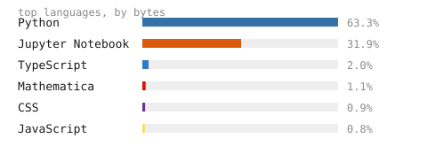
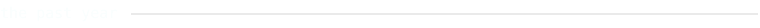
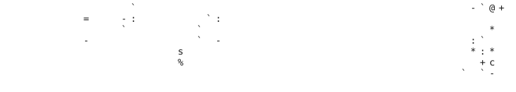

 

> Building things, mostly in the open. This page rebuilds itself every 
> night from a scheduled GitHub Action — no third-party image services, 
> no external requests, nothing that can 503 on you.

 

 

<!-- 

 

  -->

---

Portrait pipeline adapted from the ASCII Portrait README Guide.
Typeface: JetBrains Mono, SIL OFL 1.1 — licence included in
<code>assets/fonts/OFL.txt</code>. Stats regenerate nightly via
<code>.github/workflows/refresh-stats.yml</code>, using only the
GitHub GraphQL API and the Python standard library.
